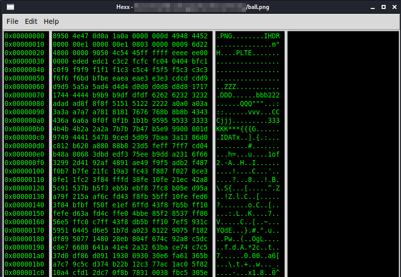

# Hexx

#### This is a hex editor. 

#### Goal : To help analyse/modify binary files like png, jpg, zip etc

#### Current Status: Can open, edit and save files

#### Future Goals -

1. Add support for multiple file formats like png,zip etc. __To implement this documentation of these file formats will have to be read thoroughly in order to gather insights from spesific bytes of binary files.__
2. Show status saved/unsaved.
3. support for multiple files to be opened simultaneously
4. Current edditing can only be done in the hex part. Add support so that modifications in ascii column also reflects when saving.
5. Add Find and Replace functionality.
6. Add some more themes

#### Demo

#### Usage
1. clone the repo `git clone https://github.com/Raahil2909/hexx.git`
2. `cd hexx`
3. `python3 main.py`
